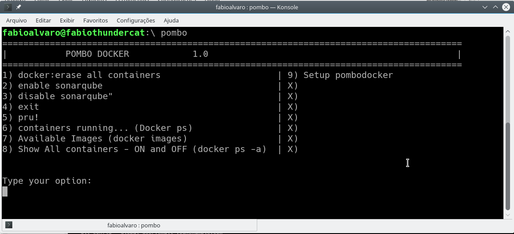

# pombodocker
pru! pru! pru!

#how to install - Step 1

    wget https://raw.githubusercontent.com/slackwarecps/pombodocker/master/pombo
    chmod +x pombo && chmod 0777 pombo
    sudo mv pombo ~bin
    pombo
  

## how to use sonaqube integrated Step 2
Please verify if you are using on default port 9000. feel free to modify the port to work in your environment

    docker run -d --name pombosonarqube -p 9000:9000 -p 9092:9092 sonarqube
    pombo

# Screenshot

